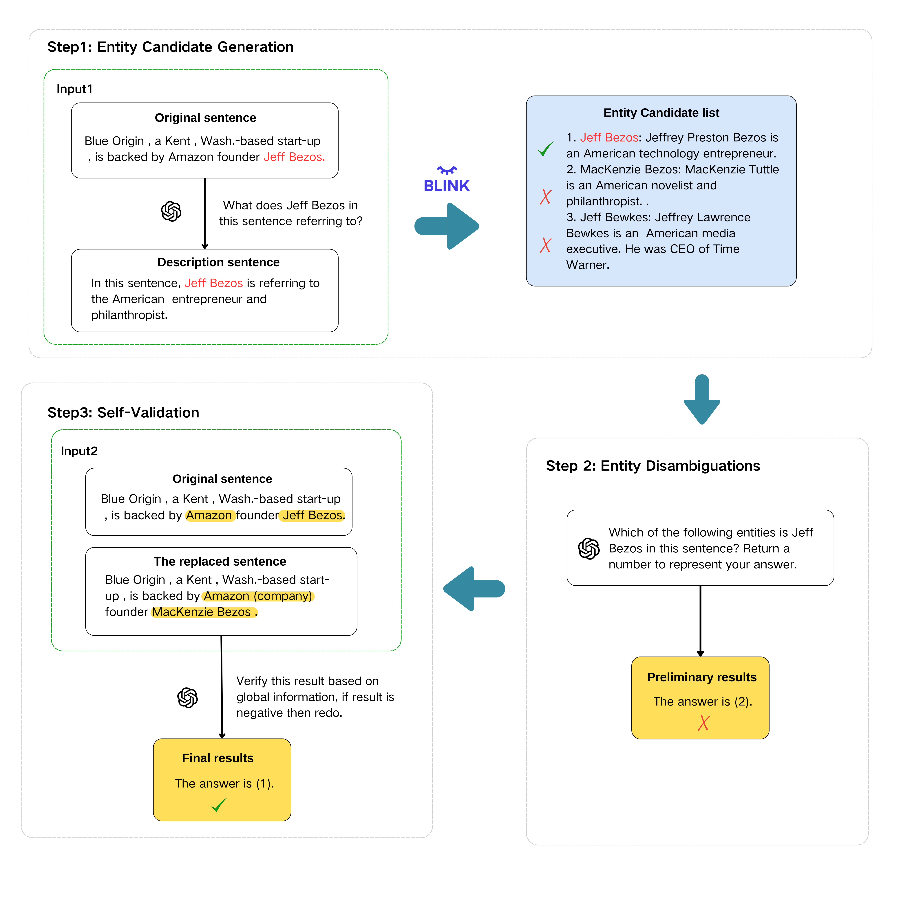

# Harnessing Deep LLM Participation for Robust Entity Linking (DeepEL)

This repository contains the official implementation and data for the paper **"Harnessing Deep LLM Participation for Robust Entity Linking"**.

## 📖 Introduction

Entity Linking (EL) is a critical task in Natural Language Understanding, aiming to map entity mentions in text to their corresponding entries in a Knowledge Base (KB). While Large Language Models (LLMs) have shown promise in this field, existing methods often apply them only to isolated stages of the pipeline.

**DeepEL** is a comprehensive framework that integrates LLMs into **every stage** of the entity linking process to maximize robustness and accuracy:

1.  **Entity Candidate Generation:** We utilize LLMs to generate contextual descriptions of entities, which are then combined with the original text to retrieve a high-quality candidate list using a dual-source retrieval strategy.
2.  **Entity Disambiguation:** The disambiguation task is formulated as a multiple-choice problem, leveraging the reasoning capabilities of LLMs to select the best fit from the candidates.
3.  **Self-Validation:** A novel mechanism where the LLM reviews its own predictions by considering the global context—specifically, the linking results of other entities within the same sentence—to rectify errors and ensure consistency.

### Model Architecture

The workflow of DeepEL is illustrated below. It demonstrates how the model processes mentions through generation, disambiguation, and the global self-validation loop.



## 🏆 Performance

Extensive experiments across ten benchmark datasets demonstrate that DeepEL significantly outperforms existing state-of-the-art methods. It is particularly effective in **Out-of-Domain (OOD)** scenarios, showing strong generalization capabilities.

**Table 1: Main Results (F1 Score)**
Comparison with SOTA methods across In-Domain and Out-of-Domain datasets.

| Model | **KORE** | **OKE15** | **REU** | **RSS** | **DER** | **OKE16** | **AQU** | **ACE04** | **MSN** | **AIDA** | **Average** | **Avg-OOD** |
| :--- | :---: | :---: | :---: | :---: | :---: | :---: | :---: | :---: | :---: | :---: | :---: | :---: |
| **REL** | 0.618 | 0.705 | 0.662 | 0.680 | 0.411 | 0.749 | 0.881 | 0.897 | 0.930 | 0.805 | 0.7338 | 0.6375 |
| **GENRE** | 0.542 | 0.640 | 0.697 | 0.708 | 0.541 | 0.708 | 0.849 | 0.848 | 0.780 | 0.837 | 0.7150 | 0.6393 |
| **ReFinED** | 0.567 | 0.781 | 0.680 | 0.708 | 0.507 | 0.794 | 0.861 | 0.864 | 0.891 | 0.840 | 0.7493 | 0.6728 |
| **BLINK** | 0.618 | 0.763 | 0.712 | 0.767 | 0.709 | 0.805 | 0.863 | 0.793 | 0.865 | 0.807 | 0.7702 | 0.7290 |
| **ChatEL** | 0.787 | 0.758 | 0.789 | 0.822 | 0.717 | 0.752 | 0.767 | 0.893 | 0.881 | 0.821 | 0.7987 | 0.7708 |
| **DeepEL (Ours)**| **0.873** | **0.833** | **0.812** | **0.857** | **0.768** | **0.762** | 0.753 | 0.888 | **0.905** | 0.799 | **0.8250** | **0.8175** |

*DeepEL achieves an average improvement of 2.6% in overall F1 score and a 4.6% gain on out-of-domain datasets compared to the previous best methods.*

## 🚀 Usage

We have provided a comprehensive Jupyter Notebook to demonstrate how to run the DeepEL framework.

To get started, please refer to the notebook located at:
**`Example_of_using/DEEPL_opensource.ipynb`**

You can use this notebook to understand how this code works.

## 📂 Data

The datasets used in this paper are currently being organized for public release.
**[Link Placeholder]** *(Data links will be updated here shortly)*

## 🖊️ Citation

If you find this work helpful, please cite our paper:

```bibtex
@misc{hou2025harnessingdeepllmparticipation,
      title={Harnessing Deep LLM Participation for Robust Entity Linking}, 
      author={Jiajun Hou and Chenyu Zhang and Rui Meng},
      year={2025},
      eprint={2511.14181},
      archivePrefix={arXiv},
      primaryClass={cs.CL},
      url={https://arxiv.org/abs/2511.14181}, 
}

@InProceedings{10.1007/978-981-95-3453-1_30,
    author="Hou, Jiajun
    and Zhang, Chenyu
    and Meng, Rui",
    editor="Yoshikawa, Masatoshi
    and Meng, Xiaofeng
    and Cao, Yang
    and Xiao, Chuan
    and Chen, Weitong
    and Wang, Yanda",
    title="Harnessing Deep LLM Participation for Robust Entity Linking",
    booktitle="Advanced Data Mining and Applications",
    year="2026",
    publisher="Springer Nature Singapore",
    address="Singapore",
    pages="410--417",
    isbn="978-981-95-3453-1"
}